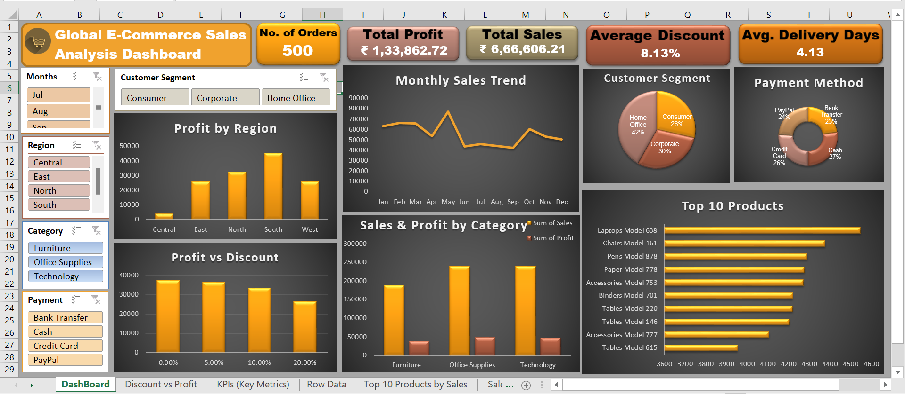

# 📊 Global E-Commerce Sales Analysis (Excel)

A complete *End-to-End Excel Data Analysis Project* designed for *Global E-Commerce Inc.*  
This project covers *Business Understanding → Data Cleaning → KPI Analysis → Dashboard Development → Insights → Final Report*.

This repository includes the *Interactive Excel Dashboard, **Business Problem Document, and the **Final Project Report PDF*.

     

---

## 🧩 Business Problem

***Global E-Commerce Inc.*** is experiencing challenges in understanding overall business performance across  
*regions, product categories, customer segments, and payment methods*. Management wants clarity on:

- Why profit margins vary across categories  
- Which regions generate the most profit  
- How discount strategies are influencing profitability  
- Customer purchasing behavior and preferred payment modes  
- Delivery performance and operational efficiency  

To address these issues, the company requires an *interactive Excel dashboard* capable of providing actionable insights for data-driven decisions.

📄 The “Business Problem” PDF is included in this repository.

---

## 📸 Dashboard Preview



---

## 📂 Project Structure

```
│
├── README.md 
│
├── Data/ 
│    └── Ecommerce_Raw_Data.xlsx
│
├── Docs/ 
│    ├── Business Problem.pdf
│    └── Global E-Commerce Sales Analysis Report.pdf
│
├── Excel-Analysis/
│    └── Global_Ecommerce_Sales_Analysis_Dashboard.xlsx
│
└── images/
    └── Dashboard_Screenshot.png
```

---

## 🚀 Features of the Dashboard

### *1. Key Metrics (KPIs)*
- Total Sales  
- Total Profit  
- Total Orders  
- Average Discount  
- Average Delivery Days  

### *2. Interactive Filters*
- Region  
- Category  
- Month  
- Payment Method  
- Customer Segment  

### *3. Visual Insights*
- Monthly Sales Trend  
- Profit by Region  
- Sales vs Profit by Category  
- Customer Segment Share  
- Payment Method Share  
- Profit vs Discount Analysis  
- Top 10 Products by Sales  

---

## 📈 Key Business Insights

- 💰 *Total Sales:* ₹6,66,606.21  
- 📈 *Total Profit:* ₹1,33,862.72  
- 📦 *Total Orders:* 500  
- 💸 *Average Discount:* 8.13%  
- 🚚 *Average Delivery Days:* 4.13 Days  

### *Insights Summary*
- 🏆 *South Region* generates the *highest profit, followed by the **East*.  
- 💼 *Technology* and *Furniture* categories lead in revenue & profit.  
- 🧑‍💼 *Home Office* (42%) is the most profitable customer segment.  
- 💳 Most customers prefer *Cash (27%)* and *PayPal (24%)* payments.  
- 🛒 *Laptops, Chairs, and Pens* dominate the Top 10 product sales.  
- 📉 Discounts between *5–10%* result in the best profit margins.  

---

## 📂 Files in This Repository

| File Name | Description |
|----------|-------------|
| Ecommerce_Raw_Data.xlsx | Original dataset used for cleaning & analysis |
| Global_Ecommerce_Sales_Analysis.xlsx | Final interactive Excel dashboard |
| Dashboard_Screenshot.png | Dashboard preview image |
| Business Problem.pdf | Detailed business problem statement |
| Global E-Commerce Sales Analysis Report.pdf | Full project analysis report (PDF) |
| README.md | Project documentation |

---

## 📝 Project Report

The PDF report includes:

✔ Business Problem  
✔ Dataset Overview  
✔ Data Cleaning Steps  
✔ Exploratory Data Analysis  
✔ KPI Interpretation  
✔ Dashboard Results  
✔ Final Insights & Recommendations  

📄 The full project report is included in the repository.

---

## 🛠 Tools & Skills Used

- *Microsoft Excel*
  - Pivot Tables  
  - Pivot Charts  
  - Slicers & Timeline  
  - Data Cleaning  
  - SUMIFS, IF, VLOOKUP, COUNTIF, etc.  
  - Conditional Formatting  

---

## 🧭 How to Use This Project

1. Download the Excel files from the repository.  
2. Open Global_Ecommerce_Sales_Analysis.xlsx.  
3. Use slicers to explore sales across regions, months, categories, and segments.  
4. Read the *Business Problem* and *Final Report* for complete understanding.  

---

## 🎯 Project Purpose

This project demonstrates how Excel can be used to:

- Track and analyze sales performance  
- Identify profitable categories & regions  
- Optimize discount strategies  
- Understand customer behavior  
- Improve business decision-making  

An excellent portfolio project for Data Analyst, Business Analyst, and BI roles.

---

## 🧑‍💻 Author

*👤 Harsh Belekar*  
📍 Data Analyst | Python | SQL | Power BI | Excel | Data Visualization  
📬 [LinkedIn](https://www.linkedin.com/in/harshbelekar) | 🔗[GitHub](https://github.com/Harsh-Belekar)

📧 [harshbelekar74@gmail.com](mailto:harshbelekar74@gmail.com)

---

⭐ If you found this project helpful, feel free to star the repo and connect with me for collaboration!
